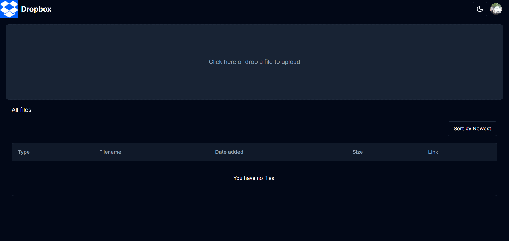

#  Dropbox Clone Project

## Overview

This project is a Dropbox clone built using modern web technologies. It leverages the power of Next.js 14 for a server-side rendered and performant experience. User authentication is handled by Clerk, offering a secure and user-friendly experience. Firebase provides reliable file storage, while Shaden UI ensures a clean and intuitive user interface. The project is hosted on Vercel, delivering global accessibility and seamless deployment.

  
  

## Features

✨ How to upload all File types to Firebase storage just like the real Dropbox!

✨ How to integrate full CRUD Functionality for the files

✨ Create a Beautiful UI & UX for our Dropbox clone using the highly Popular Shadcn!

✨ Learn how to use NextAuth Middleware to protect unauthorised access

✨ How to build a Login and Logout Authentication flow using Clerk Authentication!

✨ How to use Loaders whilst data is being fetched!

✨ Learn to implement a file sorter feature to sort all files based on various properties!

✨ Learn to implement a table view for all files with File Metadata display!

✨ How to leverage Global State Management with Zustand!

✨ How to build a beautiful UI design with Tailwind CSS!

✨ Learn how to download any uploaded file straight to your device!

✨ Learn how to implement the React DnD Library to Upload files via Drag and Drop!

✨ Learn how to implement Dark Mode toggling to update the UI based on user preference!

✨ How to use TypeScript to reduce the overall number of Bugs and Errors

✨ How to deploy the final build on Vercel!

## Technologies

  
  
  
  
  
  

## Architecture

- **Frontend**: Built with Next.js, Tailwind CSS and Shaden UI framework and library, responsible for user interface and interaction.
- **Backend**: Built with Next.js API routes, handling data retrieval and manipulation.
- **Authentication**: Managed by Clerk, providing secure user login and authorization.
- **Storage**: Firebase Storage stores uploaded files securely and reliably.
- **Deployment**: Vercel delivers the application globally with fast and efficient deployment processes.

## Technical Details

## Installation Setup

## Usage

## Additional Notes
